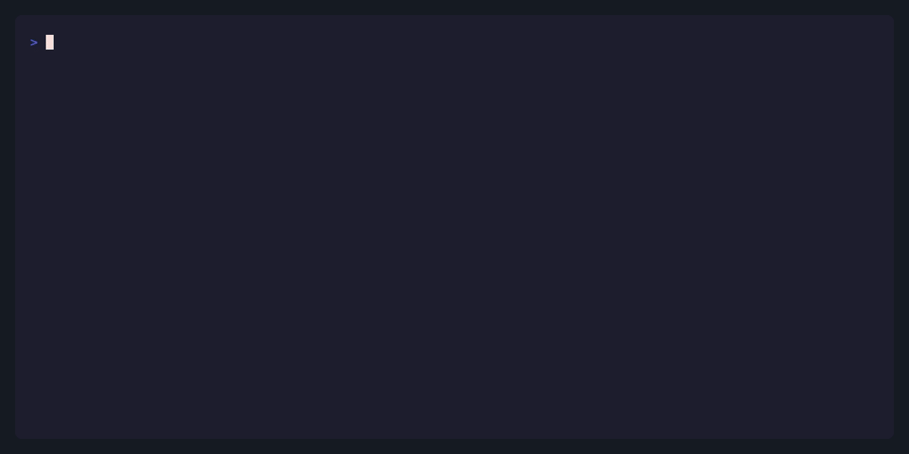

# clai

`stdin` → LLM → `stdout`.

`clai` is a tool, not a platform. It amplifies your workflow, never captures it.

[](https://github.com/maxrodrigo/clai/actions/workflows/ci.yml)
[](https://goreportcard.com/report/github.com/maxrodrigo/clai)
[](https://github.com/maxrodrigo/clai/releases)
[](LICENSE)

<br>

```sh
cat article.txt | clai summarize
git diff HEAD~1 | clai code-review
clai -e "Explain this code" main.go
```



> _Write programs that do one thing and do it well._
> _Write programs to work together._
> _Write programs to handle text streams, because that is a universal interface._
>
> — Doug McIlroy

- [Highlights](#highlights)
- [Install](#install)
- [Quick Start](#quick-start)
- [Configuration](#configuration)
- [Providers](#providers)
- [Prompts](#prompts)
- [Strategies](#strategies)
- [Structured Output](#structured-output)
- [CLI Reference](#cli-reference)

**More docs:**
[Recipes](docs/RECIPES.md) ·
[Advanced](docs/ADVANCED.md) ·
[Manifest](docs/MANIFEST.md)

---

## Highlights

- **Pipeline native** — stdin in, stdout out. Composes with grep, jq, awk, and everything else.
- **Works with any source** — YouTube transcripts, web pages, PDFs, git diffs, clipboard. Pipe it in. See [Recipes](docs/RECIPES.md).
- **Zero config** — Set one API key and go. No setup wizards, no interactive prompts.
- **Built-in prompts** — summarize, code-review, commit, translate, explain, and more.
- **Multi-provider** — OpenAI, Anthropic, Bedrock, Ollama, or any OpenAI-compatible endpoint.
- **Reasoning strategies** — Chain-of-Thought, Tree-of-Thought, Chain-of-Draft, Self-Refine.
- **Structured output** — JSON Schema validation with a dedicated exit code.

## Install

```sh
brew install maxrodrigo/tap/clai
```

Or with Go:

```sh
go install github.com/maxrodrigo/clai/cmd/clai@latest
```

Pre-built binaries available on the [Releases](https://github.com/maxrodrigo/clai/releases) page.

> **Note:** `go install` installs the binary only. For system prompts and strategies, run:
>
> ```sh
> curl -sL https://github.com/maxrodrigo/clai/releases/latest/download/clai-data.tar.gz | tar -xz -C ~/.local/share
> ```

## Quick Start

```sh
# Set a provider key
export OPENAI_API_KEY="sk-..."

# Named prompts
clai summarize article.txt
clai code-review main.go

# Inline prompt
clai -e "Explain in simple terms" complex.txt

# Pipeline
git diff --cached | clai commit
curl -s https://api.example.com/data | clai -e "Find anomalies"
```

---

## Configuration

clai reads configuration from TOML files:

```
~/.config/clai/config.toml    # User config
.clai/config.toml             # Project config (overrides user)
```

Example:

```toml
model = "openai/gpt-4.1"
temperature = 1.0
max_tokens = 4096

[providers.openai]
api_key = "${OPENAI_API_KEY}"

[providers.anthropic]
api_key = "${ANTHROPIC_API_KEY}"
```

See [docs/ADVANCED.md – Configuration Reference](docs/ADVANCED.md#configuration-reference) for a complete sample with all available options and their defaults.

### Environment Variables

All config values can be set via `CLAI_` prefix:

```sh
export CLAI_MODEL="anthropic/claude-sonnet"
export CLAI_TEMPERATURE="0.7"
export CLAI_MAX_TOKENS="8192"
```

Provider API keys use their standard environment variables:

```sh
export OPENAI_API_KEY="sk-..."
export ANTHROPIC_API_KEY="sk-ant-..."
export AWS_BEARER_TOKEN_BEDROCK="..."
```

### Precedence

Configuration is merged in order (later overrides earlier):

1. Built-in defaults
2. Prompt frontmatter defaults
3. User config (`~/.config/clai/config.toml`)
4. Project config (`.clai/config.toml`)
5. Environment variables (`CLAI_*`)
6. CLI flags

---

## Providers

Models are specified as `provider/model-name`. Each provider requires an API key — set it via environment variable or config file.


<details open>
<summary><strong>OpenAI</strong></summary>

Docs: https://platform.openai.com/docs

```sh
export OPENAI_API_KEY="sk-..."
clai summarize -m openai/gpt-4.1 article.txt
```

</details>

<details>
<summary><strong>Anthropic</strong></summary>

Docs: https://docs.anthropic.com

```sh
export ANTHROPIC_API_KEY="sk-ant-..."
clai summarize -m anthropic/claude-sonnet article.txt

# Extended thinking
clai analyze -m anthropic/claude-sonnet --think problem.txt
```

</details>

<details>
<summary><strong>AWS Bedrock</strong></summary>

Docs: https://docs.aws.amazon.com/bedrock

```sh
export AWS_BEARER_TOKEN_BEDROCK="..."
clai summarize -m bedrock/us.anthropic.claude-sonnet article.txt
```

Config (to change region):

```toml
[providers.bedrock]
api_key = "${AWS_BEARER_TOKEN_BEDROCK}"
base_url = "https://bedrock-runtime.us-west-2.amazonaws.com"
```

</details>

<details>
<summary><strong>Custom Providers (Ollama, Groq, etc.)</strong></summary>

Any OpenAI-compatible API:

```toml
[providers.groq]
api_key = "${GROQ_API_KEY}"
base_url = "https://api.groq.com/openai/v1"

[providers.ollama]
base_url = "http://localhost:11434/v1"
```

```sh
clai summarize -m groq/llama-4-scout article.txt
clai summarize -m ollama/llama3.3 article.txt
```

</details>

---

## Prompts

Prompts are markdown files that tell the model what to do.


```sh
# Named prompts
clai summarize article.txt
clai code-review code.patch
clai translate notes.md

# Inline prompt with -e
clai -e "Explain this code" main.go

# Prompt from file with -f
clai -f my-prompt.md article.txt

# List available prompts
clai prompt list
clai prompt show summarize
```

### Creating Prompts

Create a file in `~/.config/clai/prompts/`:

```markdown
---
description: One-line for `clai prompt`
model: anthropic/claude-sonnet # optional
temperature: 0.7 # optional
strategy: cot # optional
---

Your prompt instructions here.
```

Use it immediately:

```sh
clai your-prompt input.txt
```

Prompts are resolved in order (first match wins):

1. `.clai/prompts/` — Project-local
2. `~/.config/clai/prompts/` — User
3. Built-in

### Per-Prompt Model Override

Override a prompt's model via environment variable using the pattern `CLAI_MODEL_<PROMPT_NAME>`:

```sh
export CLAI_MODEL_CODE_REVIEW="anthropic/claude-sonnet"
export CLAI_MODEL_SUMMARIZE="openai/gpt-4.1-mini"
```

See [docs/ADVANCED.md](docs/ADVANCED.md) for prompt authoring principles, composition, and the evaluation checklist.

---

## Strategies

Strategies modify how the model reasons through problems.


| Strategy      | Description                                             |
| ------------- | ------------------------------------------------------- |
| `cot`         | Chain-of-Thought — think step by step                   |
| `cod`         | Chain-of-Draft — minimal notes per step (saves tokens)  |
| `tot`         | Tree-of-Thought — explore multiple paths, pick the best |
| `self-refine` | Answer, critique, improve                               |

```sh
clai analyze --strategy cot problem.txt
clai analyze --strategy none problem.txt   # disable
clai strategy                               # list all
```

Create custom strategies in `~/.config/clai/strategies/`. See [docs/ADVANCED.md](docs/ADVANCED.md) for research basis, when to use each, and custom strategy authoring.

---

## Structured Output

Use `--schema` to get JSON output conforming to a schema.


```sh
# Shorthand syntax
clai parse -s '{"name": "str", "amount": "float"}' invoice.txt

# Full JSON Schema
clai parse -s '{"type": "object", "properties": {"items": {"type": "array"}}}' data.txt
```

Shorthand types: `str`, `int`, `float`, `bool`, `date`, `list`, `{"nested": "str"}`.

Schema can also be set in prompt frontmatter:

```markdown
---
schema:
  title: str
  author: str
  tags: list
---

Extract metadata from this article.
```

---

## CLI Reference

```
clai [flags] <prompt> [files...]
```

### Flags

| Flag                | Description                                     |
| ------------------- | ----------------------------------------------- |
| `-e, --expression`  | Inline prompt text                              |
| `-f, --file`        | Read prompt from file                           |
| `-m, --model`       | Model to use (e.g., `openai/gpt-4.1`)           |
| `-t, --temperature` | Sampling temperature (0.0–2.0)                  |
| `--max-tokens`      | Maximum tokens to generate                      |
| `-s, --schema`      | Output schema (shorthand or JSON Schema)        |
| `--strategy`        | Reasoning strategy (cot, cod, tot, self-refine) |
| `--think`           | Enable extended thinking (Anthropic/Bedrock)    |
| `-n, --dry-run`     | Show what would be sent without calling model   |
| `-v, --verbose`     | Print token counts and timing to stderr         |
| `--color`           | Force colored output even when stdout is not a TTY |
| `--no-color`        | Disable colored output                          |
| `--version`         | Print version and exit                          |

### Commands

| Command                                     | Description                                    |
| ------------------------------------------- | ---------------------------------------------- |
| `clai prompt list`                          | List available prompts                         |
| `clai prompt show <name>`                   | Show prompt content                            |
| `clai prompt path <name>`                   | Show prompt file location                      |
| `clai prompt add <name>`                    | Create a new prompt and open in `$EDITOR`      |
| `clai prompt update <name>`                 | Edit an existing prompt in `$EDITOR`           |
| `clai prompt remove <name>`                 | Remove a user-installed prompt                 |
| `clai prompt install <owner/name> <file>`   | Install a prompt from a file under a namespace |
| `clai strategy list`                        | List available strategies                      |
| `clai strategy show <name>`                 | Show strategy content                          |
| `clai strategy path <name>`                 | Show strategy file location                    |
| `clai model list`                           | List available models                          |

### Exit Codes

| Code | Meaning                                               |
| ---- | ----------------------------------------------------- |
| 0    | Success                                               |
| 1    | Runtime error (API failure, network error)            |
| 2    | Usage error (invalid arguments, missing config)       |
| 3    | Schema validation error (output doesn't match schema) |

### Examples

```sh
# Basic
cat doc.txt | clai summarize
clai summarize doc.txt
clai -e "Summarize in one sentence" doc.txt

# Different models
clai summarize -m anthropic/claude-sonnet doc.txt
clai summarize -m ollama/llama3.3 doc.txt

# Structured output
clai parse -s '{"name": "str", "email": "str"}' contact.txt

# Reasoning strategies
clai analyze --strategy cot complex-problem.txt

# Extended thinking
clai analyze --think -m anthropic/claude-sonnet hard-problem.txt

# Multiple sources
clai summarize report.txt notes.txt

# Chain with other tools
git diff HEAD~1 | clai code-review
clai summarize article.txt | clai translate
curl -s api.example.com/data | clai -e "Find anomalies" | jq .

# Dry run
clai summarize -n doc.txt
```

### Shell Completion

```sh
clai completion zsh --help
clai completion bash --help
clai completion fish --help
```
